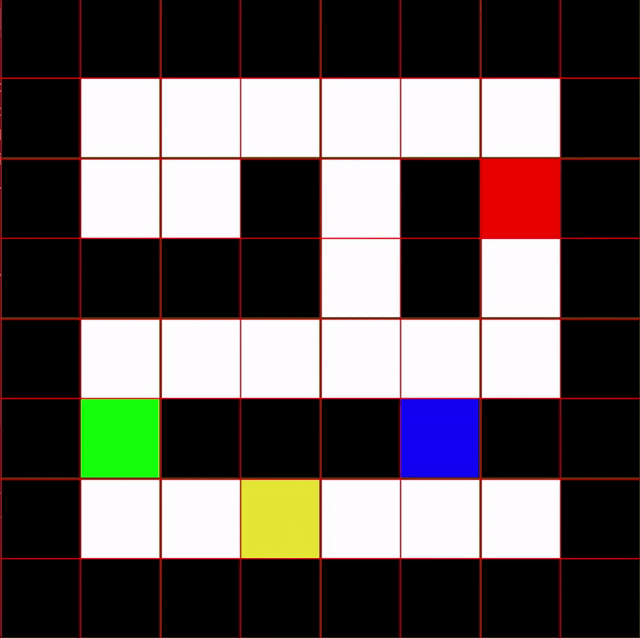
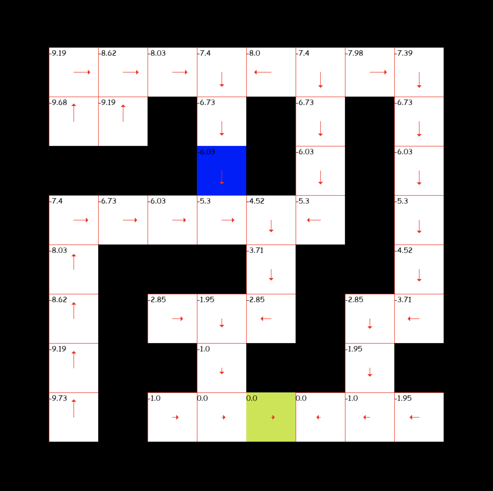

# Deep learning project : Multi-Agent Traffic Optimization using Reinforcement Learning

Arthur Lindoulsi <br>
Terence Le Huu Phuong <br>

<p align="center">

<br>
Double DQN
</p>

<br>
We investigate the problem of traffic optimization through a reinforcement learning approach.
The agents are located in a spatial grid world environment and have to reach a destination as fast as possible.
The challenge is to flexibly control a fixed number of agent while achieving effective collaboration over different grid-world configuration.

The agents have to optimize their own path as well as their overall score, and thus need to take other agents’ path into consideration. We propose an architecture that learns the spatial representations of the agents and their destination, and outputs grid-wise actions.

Each agent is given its own control action from the tile it stands on, in order to maximize the group’s reward. We employ a convolutional network as policy over a pixels feature map. The stacked convolutional layers provide a large receptive field and spur agents to communicate.
Beside collaboration, agents also share their learning experience by sharing the convolutional layers.
<br>
<br>
<br>

<p align="center">

<br>
Temporal difference with one car
</p>
<br>

## Configuration
The config.json file contains all parameters to launch a training or to test a model. Here is the parameter meaning:

 * The parameters related to the agent that we train are stored in the agent field.

```
{"agent":{"gamma" :0.9,
          "epsilon" : 0.9,
          "lr" : 0.01,
          "input_dims": [3, 8, 8],
          "n_actions" : 5,
          "mem_size" : 128,
          "eps_min" : 0.1,
          "batch_size" : 64,
          "replace" : 100,
          "eps_dec" : 0.0001,
          "number_of_cars": 2
          }
```
-gamma is the gamma value in the Bellman equation of Q-learning

-epsilon is a value that will be decremented during training. At every step of training process, 
the agent explores a new transition with the probability epsilon for it to be a random one and 1-epsilon to be
the one he thinks is the best with the current state of the environment.

-input_dims is the dimensions for the input of the network, as we built the environment, it is always 3*gridshape

-n_actions is the number of possible actions for each car

-mem_size is the number of transition we store in our replaymemory that we use for training

-replace is the number of steps we wait before copying q_eval to q_next

-eps_dec is the value we decrement epsilon every step

* The other parameters are the following:

```
"render_for_eval" : false,
"path_to_save" : "nets/weights",
"games_for_training" : 30,
"depth_for_traintries" : 30,
"games_for_evaluation" : 100,
"depth_for_evaltries" : 50,
"path_weights_to_test" : "nets/weights_with_3cars_for_1000traingames",
"games_for_test" : 100,
"depth_for_test" : 30,
"map_path": "environment/map_2.txt",
"train_from_checkpoint" : true,
"save_checkpoint_period" : 3,
"checkpoint_path" : "checkpoint"
```
-render_for_eval is a bollean to set to true if we want the evaluation process will be shown in pygame

-path_to_save is the path to save the trained model

-games parameters defines the number of games for train, eval and test

-depths parameters is the number of actions we want the model to do at maximum before stopping a game (if he has 
a success before it will of course stop before)

-map_path contains the training map

-train_from_checkpoint tells if we want to start from the last checkpoint saved (its parameters will be loaded)

-save_checkpoint_period is the number of games between two save of a checkpoint

-checkpoint_path is the path to save the checkpoints

## Launch a training

After setting the parameters right, a training can be launched running simply terence_main.py
```
python3 train.py
```
 
 ## Test a model
 
 To test and see what a model does with pygame, just change the path_weights_to_test variable in the config.json to the location 
 of your weights and run tester.py
 
 ```
 python3 tester.py
 ```
